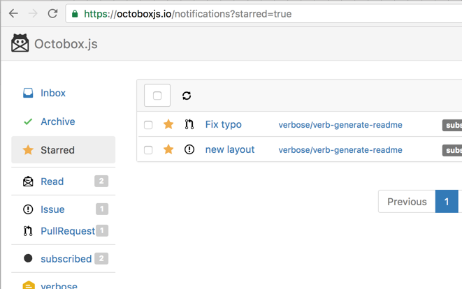

# 

> 





## Table of Contents

<details>
<summary><strong>Table of Contents</strong></summary>
<!-- toc -->
</details>

<!-- toc -->


## Motivation

This is a port of [Octobox](https://github.com/octobox/octobox) from Ruby to JavaScript using [express][], [sequelize][], and [handlebars][] instead of Rails, ActiveDirectory, and erb.

The goal is to learn more about the pieces of Rails and ActiveDirectory that are missing from Node.js and fill the gap by using other tools like [assemble][] and [generate][] and by creating missing tools like [helper-octicon][].

You can also read about the original motivation and features of the Octobox project [here](https://github.com/octobox/octobox#why-is-this-a-thing).

## Usage

There is [a hosted version](https://octoboxjs.io) available to try now.

You may also [deploy to heroku](#deployment-to-heroku) and host it yourself.

## Requirements

Web notifications must be enabled in your GitHub settings for Octobox.js to work: https://github.com/settings/notifications


## Deployment to Heroku

You can host your own instance of Octobox.js using Heroku.

[](https://heroku.com/deploy)

Heroku will ask you to provide a `GitHub Client ID` and `GitHub Client Secret` which you can get from GitHub by creating a new [OAuth Application](#github-oauth-application).

Optionally, you may set a Google Analytics Tracking ID that will place the Google Analytics script in each page.

## Development

The source code is hosted at [GitHub](https://github.com/doowb/octobox.js).

### Getting started

Since this is a port to Node.js, you'll need [Node.js](https://nodejs.org) and [NPM](https://www.npmjs.com/). NPM will be installed when installing Node.js.

Once you have Node.js installed, git clone the repository:

```sh
$ git clone https://github.com/doowb/octobox.js.git
```

Then install the npm dependencies:

```sh
$ cd octobox.js
$ npm install
```

#### Local database

You'll need a local PostgreSQL database installed. On OSX you may use [Homebrew](http://mxcl.github.io/homebrew/) or the [PostgresApp](http://postgresapp.com). Please see these [further instructions for installing Postgres via Homebrew](http://www.mikeball.us/blog/setting-up-postgres-with-homebrew/).

```sh
$ brew install postgres
```

On Debian-based Linux distributions you can use apt-get to install Postgres:

```sh
$ sudo apt-get install postgresql postgresql-contrib libpq-dev
```

Next, you'll need to create the `development` and `test` databases:

Using `psql`:

```sh
$ psql
```

Create `octobox_development` and `octobox_test` databases:

```sql
> CREATE DATABASE octobox_development;
> CREATE DATABASE octobox_test;
```

Optionally, you may create a "production" database named `octobox`:

```sql
> CREATE DATABASE octobox;
```

These database names may be changed as long as the [configuration files](#configuration) are changed to reflect the same names.

#### GitHub OAuth Application

Register a new [OAuth Application](https://github.com/settings/applications/new) for your development environment using the following settings:


If you're deploying this to production, just replace `http://localhost:3000` with your application's URL.


#### Configuration

The repository has `config.json` files ignored in [.gitignore](./.gitignore) to allow for keeping secrets, for your development environment, private. There are 2 files that should be added.

The first is `config.json` in the root of the project:

```json
{
  "url": "http://localhost:3000",
  "GITHUB_CLIENT_ID": "YOUR_GITHUB_CLIENT_ID",
  "GITHUB_CLIENT_SECRET": "YOUR_GITHUB_CLIENT_SECRET",
  "ga": {"trackingId": "YOUR_GA_TRACKING_ID"}
}
```

This file contains the following properties:

- `url`: Site URL (used for building links)
- `GITHUB_CLIENT_ID`: Your GITHUB_CLIENT_ID from your [OAuth Application](#github-oauth-application)
- `GITHUB_CLIENT_SECRET`: Your GITHUB_CLIENT_SECRET from your [OAuth Application](#github-oauth-application)
- `ga`: An object with a `trackingId` property that has your Google Analytics tracking id. This is optional and if left out will leave out the Google Analytics code.


The second file is `db/config.json` in the `db` folder:

```json
{
  "development": {
    "username": "doowb",
    "password": null,
    "database": "octobox_development",
    "host": "127.0.0.1",
    "dialect": "postgres"
  },
  "test": {
    "username": "doowb",
    "password": null,
    "database": "octobox_test",
    "host": "127.0.0.1",
    "dialect": "postgres"
  },
  "production": {
    "use_env_variable": "DATABASE_URL"
  }
}
```

This file contains the environment based configurations for the [PostgreSQL database](#local-database).
Each environment (`development`, `test`, `production`) may have different configuration objects. Each configuration object may have the following properties:

- `username`: PostgreSQL username
- `password`: PostgreSQL password
- `database`: PostgreSQL database (this should match the database created [earlier](#local-database))
- `host`: Where the database is located
- `dialect`: "postgres" This should be "postgres" if you're following this Readme. Since this project uses [sequelize][], you have an option to use another database engine if you'd like.
- `use_env_variable`: Rather than setting all of the properties above, you may set a connection string on an environment variable and specify this variable here. When [deploying to Heroku](#deployment-to-heroku) this is the option that's used and the default environment variable is `DATABASE_URL`.

#### Start

Now you can start the Node.js application using the following command:

```sh
$ npm start
```

If there are no errors, you can open the app in a browser at [http://localhost:3000](http://localhost:3000) and login through GitHub.

## About
### Related projects




### Contributing


### Running tests



### Author


### License



***




